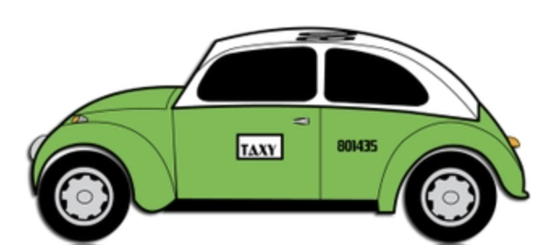

## Time Series Taxi Driver Predictions

<p align="center">
  
</p>

### Table of Contents

1. [Project Overview](#overview)  
2. [Installation and Setup](#setup)  
3. [Data](#data)  
4. [Code Structure](#structure)  
5. [Results and Evaluation](#results)  
6. [Conclusions and Business Recommendations](#conclusions)

[View Project Code](https://github.com/kellyshreeve/forecasting-taxi-orders/blob/main/notebooks/taxi_analysis.ipynb)

### 1. Project Overview<a id='overview'></a>
**Background:** Sweet Lift Taxi company has historical data on taxi orders over time and wants to predict the number of taxi orders expected in future hours.  

**Purpose:** Build a time series model that minimizes RMSE when predicting the number of taxi orders in the next hour.  

**Techniques:** Seasonal decomposition, tuning time series linear regression and random forest regression with skforecast.  

### 2. Installation and Setup<a id='setup'></a>

#### Codes and Resources Used

  - **Editor Used**: Visual Studio Code
  - **Python Version**: 3.10.9

#### Python Packages Used

  - **General Purpose**: ```numpy, time```  
  - **Data Manipulation**: ```pandas```  
  - **Data Visualization**: ```seaborn```  
  - **Machine Learning**: ```sklearn```  
  - **Time Series Modeling**: ```statsmodels, skforecast```

### 3. Data<a id='data'></a>

*taxi.csv* 

**Target**:   
* *num_orders*: taxi rides ordered per hour

**Features**:   
* *rolling_mean*: rolling mean of prior 24 hours
* *year*: year of taxi order
* *month*: month of taxi order
* *day*: day of taxi order
* *dayofweek*: day of week of taxi order
* *hour*: hour of day
 
#### Data Acquisition

The data were provided by TripleTen's Data Science bootcamp. The full dataset is loaded into the notebook but is proprietary information and cannot be shared online.

#### Data Preprocessing

Data were checked for missing values and duplicates. None were found.

Six additional features were created:  
1. rolling_mean for 24 hours prior
2. year
3. month
4. day
5. day of week
6. hour

### 4. Code Structure<a id='structure'></a>
```
  ├── LICENSE
  ├── README.md          
  │
  ├── images
  │   └── churn_over_time.png
  │   └── class_imbalance.png 
  │   └── correlation_heatmap.png 
  │   └── histograms.png 
  │   └── test_results.png 
  │   └── training_results.png     
  │
  └── notebooks  
      └── taxi_analysis.ipynb
```

### 5. Results and Evaluation<a id='results'></a>

#### Exploratory Analysis
 
<p align="center">
  
</p>

There are both seasonality and an upward trend in number of taxi orders per hour. Both the mean and standard deviation increase over time, so this is a non-stationary timeseries.

<p align="center">
  
</p>

There is a confirmed upward trend. Seasonality occurs in very short timeframes - possibly within the day.
 
<p align="center">
  
</p>

Seasonality occurs within the day. Orders start low in the early morning and generally climb through the night.

#### Train Results

<p align="center">
  
</p>

Using a rolling mean of size 24 and 73 lag features, linear regression trained on the training set was able to achieve and RMSE of 38.95 on the validate set. This is better than the base model using only the previous prediction.

<p align="center">
  
</p>


The tuned random forest was able to acheive and RMSE of 33.25 on the validate set. This is better than the RMSE on linear regression, meaning random forest regression better predicts future orders than linear regression.

#### Test Results

<p align="center">
  
</p>

The random forest model trained on the train and validate sets was able to acheive and RMSE of 40.29 on the test set.

### 6. Conclusions and Business Recommendations<a id='conclusions'></a>

#### Conclusions

Swift Lift Taxi Company wanted to predict the number of taxi orders in the next hour, using historical time series data. This was a non-stationary time series problem, with both mean and standard deviation increasing over time. Taxi orders had a general upward trend over time and seasonality by day.  

Both linear regression and random forest models were tuned with a validation set to predict orders in the next hour. Random forest regression with 50 trees, max depth of 15, and 170 lag features (RMSE = 33.25) outperformed the linear regression with 73 lag variables (RMSE = 38.95). The random forest regression had a similar RMSE when tested on the test set (RMSE = 40.29). The model is likely not overfit.

#### Business Recommendations 

Going forward, Swift Lift Taxi Company can use the random forest regression model to predict how many orders they will receive in the next hour. They can use this information to post special promotions to attract more drivers during busy times and consumer promotions to attract more customers during slow times.

[View Project Code](https://github.com/kellyshreeve/forecasting-taxi-orders/blob/main/notebooks/taxi_analysis.ipynb)
